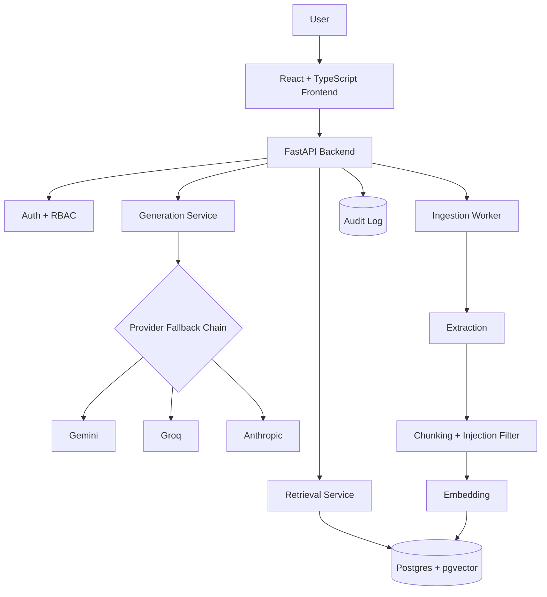

# ReliefIQ

**An AI-powered knowledge and governance assistant for NGO staff — grounded answers, gap detection, and policy conflict detection, all traceable back to your organisation's own documents.**

ReliefIQ lets NGO staff ask natural-language questions and get answers cited directly from internal policy documents — with role-based access, an audit trail, and two governance-focused features (compliance gap detection and policy conflict detection) that go beyond simple document Q&A.

---

## Why ReliefIQ

Most "chat with your documents" tools stop at retrieval-augmented Q&A. ReliefIQ was built around a stricter premise: **an answer is only useful if it's traceable, permission-aware, and honest about what it doesn't know.** Every design decision follows from that:

- Answers are generated **only** from retrieved organisational content, never the model's general knowledge
- Every claim is cited; answers without verifiable citations are rejected server-side, not just requested via prompt
- Access is role-aware — a field worker and a program manager can ask the same question and legitimately get different results
- Every meaningful action is recorded in an audit trail an admin can actually review
- If an answer is low-confidence, ungrounded, or touches a sensitive category, the system says so and points to a human — it doesn't guess

## Key Features

### Core Q&A
- **Hybrid retrieval** over your own document library using pgvector similarity search
- **Grounded, cited generation** — every factual claim is traceable to a numbered source excerpt
- **Confidence scoring** (High / Medium / Low) based on retrieval match quality
- **Threaded chat interface** — ChatGPT-style sidebar with conversation history, grouped by recency, fully persisted across sessions

### Resilience
- **Multi-provider LLM fallback chain** (Gemini → Groq → Anthropic, OpenAI optional) with automatic cooldown and self-healing recovery
- Clean, user-facing error handling if every provider is temporarily unavailable — no raw server errors reach the UI

### Guardrails
- **Citation enforcement** — an LLM response with no verifiable citations is discarded and replaced with a safe fallback, never silently trusted
- **Prompt-injection defense**, applied at two points: primarily at ingestion time (when a document is first chunked), with a second defense-in-depth pass at query time
- **Human escalation** — low-confidence answers, rejected/ungrounded responses, and sensitive-category questions (safeguarding, legal, HR) are flagged with a suggested contact, not just answered blindly

### Access Control
- **Role-based access** across three tiers — `field_staff`, `manager`, `admin` — enforced at the API layer, not just hidden in the UI
- **Document-level restriction** — individual documents can be marked manager/admin-only and are excluded from retrieval entirely for other roles, not just hidden from the document list

### Document Management
- **Versioning** — replacing a document creates a new version linked to the old one; the old version is excluded from retrieval but preserved for audit history
- Upload validation, background processing pipeline (extraction → chunking → embedding), and live status tracking

### Governance Intelligence
- **Gap detection** — upload or paste a donor's policy requirements; ReliefIQ compares each requirement against your existing internal policies and flags what's covered, partially covered, or missing entirely
- **Conflict detection** — for any document, finds topically related content elsewhere in your knowledge base and flags genuine contradictions (e.g. one policy permitting something another prohibits), with a confidence score and explanation

### Observability
- **Full audit logging** — every sign-in, upload, query, and governance-tool run is recorded
- **Admin-only audit log viewer** with filtering by action type and user, not just raw database access

---

## Architecture



## Tech Stack

| Layer | Technology |
|---|---|
| Backend | FastAPI, SQLAlchemy, Alembic, Pydantic v2 |
| Database | PostgreSQL with `pgvector` |
| Embeddings | sentence-transformers (`all-MiniLM-L6-v2`, 384-dim) |
| LLM Providers | Google Gemini, Groq, Anthropic Claude (OpenAI optional) |
| Frontend | React, TypeScript, Vite, Tailwind CSS |
| Auth | JWT-based, bcrypt password hashing, rate-limited endpoints |

## Project Structure

```
ReliefIQ/
├── backend/
│   ├── app/
│   │   ├── api/v1/          # Route handlers (auth, documents, query, conversations,
│   │   │                       gap_detection, conflict_detection, admin_audit_log)
│   │   ├── models/          # SQLAlchemy models
│   │   ├── schemas/         # Pydantic request/response schemas
│   │   ├── services/        # Business logic (retrieval, generation, chunking,
│   │   │                       embedding, audit, content safety, ingestion)
│   │   ├── workers/         # Background ingestion pipeline
│   │   ├── config.py
│   │   ├── database.py
│   │   └── main.py
│   ├── alembic/              # Database migrations
│   └── storage/documents/    # Uploaded files (gitignored)
└── frontend/
    └── src/
        ├── components/       # ChatPanel, ConversationSidebar, DocumentsPanel,
        │                       GapDetectionPanel, ConflictDetectionPanel, AuditLogPanel
        ├── pages/             # Dashboard, SignIn, SignUp
        └── lib/               # API client, theme tokens
```

## Getting Started

### Prerequisites
- Python 3.12+
- Node.js 18+
- PostgreSQL with the `pgvector` extension enabled
- API keys for at least one LLM provider (Gemini, Groq, or Anthropic)

### Backend

```bash
cd backend
python -m venv venv

# Windows
venv\Scripts\Activate
# macOS/Linux
source venv/bin/activate

pip install -r requirements.txt
cp .env.example .env   # then fill in your own values — see below
alembic upgrade head
uvicorn app.main:app --reload
```

### Frontend

```bash
cd frontend
npm install
npm run dev
```

The app will be available at `http://localhost:5173`, talking to the API at `http://127.0.0.1:8000`.

### Environment Variables

| Variable | Description |
|---|---|
| `DATABASE_URL` | PostgreSQL connection string |
| `JWT_SECRET_KEY` | Secret used to sign auth tokens — generate a real random value, never use a placeholder |
| `GENERATION_PROVIDER` | Primary LLM provider (`gemini`, `groq`, or `anthropic`) |
| `FALLBACK_PROVIDERS` | Comma-separated fallback order, e.g. `groq,anthropic` |
| `GEMINI_API_KEY` / `GROQ_API_KEY` / `ANTHROPIC_API_KEY` | Provider API keys — only the ones you intend to use need to be set |
| `MAX_UPLOAD_SIZE_MB` | Max document upload size (default: 25) |
| `STORAGE_DIR` | Local path for uploaded document storage |

## Roles & Permissions

| Capability | Field Staff | Manager | Admin |
|---|:---:|:---:|:---:|
| Ask questions / view chat history | ✅ | ✅ | ✅ |
| View/upload/version documents | ❌ | ✅ | ✅ |
| Restrict documents to manager/admin | ❌ | ✅ | ✅ |
| Run gap detection | ❌ | ✅ | ✅ |
| Run conflict detection | ❌ | ✅ | ✅ |
| View the audit log | ❌ | ❌ | ✅ |

## Known Limitations

Being upfront about what's intentionally out of scope for the current version:

- **Single point of failure in practice** — while three providers are supported, only one may be genuinely available at a given time depending on account status/region; this is an external dependency issue, not a code limitation
- **No automated test suite** yet
- **Local filesystem storage** for uploaded documents — not suitable for most PaaS deployments without a persistent volume or object storage swap
- **PII masking** and an **analytics dashboard** are planned but not yet implemented
- Requirement/chunk splitting in gap and conflict detection is heuristic-based, not a true document-structure parser

## Roadmap

- [ ] Policy version comparison (diff two versions of a document)
- [ ] Duplicate document detection
- [ ] Compliance scoring by department/program
- [ ] Policy expiry and review reminders
- [ ] Policy impact analysis (what else might a policy change affect)
- [ ] Org-wide compliance dashboard
- [ ] PII masking on ingestion
- [ ] Usage analytics dashboard

## License

*(Add a license — MIT is a common choice for portfolio projects. Add a `LICENSE` file to the repo root if you choose one.)*
